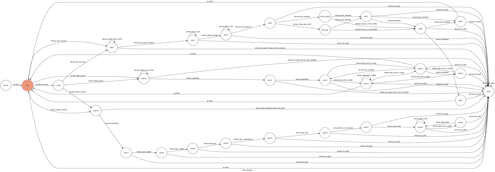
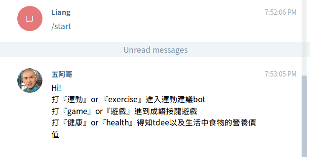
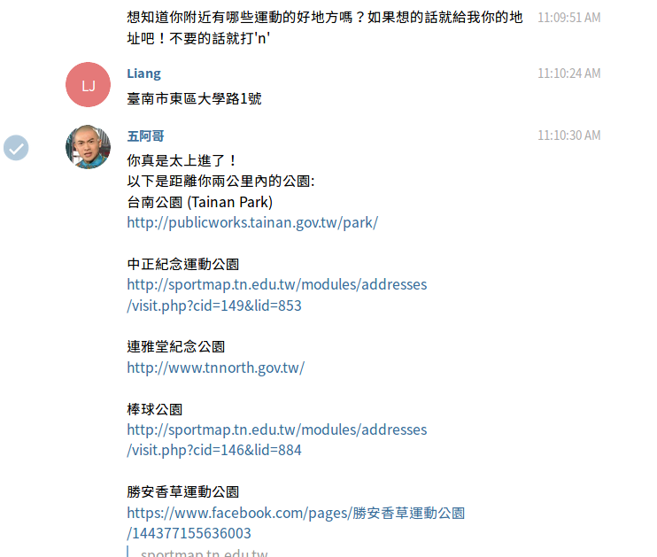

# JIALOOP BOT

Final Project

## Setup
### Prerequisite
* Python 3


#### Install Dependency
```sh
pip install -r requirements.txt
```

```
pip3 install https://github.com/slimkrazy/python-google-places/zipball/master
```

#### Run
set up https server

python3 app.py

## Finite State Machine


## Usage
initial state`user`

Every time `user` state is triggered to `advance` to another state, it will `go_back` to `user` state after the bot replies corresponding message.

* user

	a. 運動：提供用戶地點的天氣資訊（透過parse氣象局網站）給予建議在哪天進行室外運動較適合，並依照其位置透過google place api探索附近運動室內外場所，並且提供健身菜單給用戶作為參考
	
	b. 成語接龍：跟博學多聞的五阿哥玩成語接龍，阿哥人很好，不會的話都會給提示，此部份用到教育部成語字典的opendata
	
	c. 健康資訊：透過身高體重年齡計算tdee, 並且計算出每日所需的三大營養素含量，用戶在得知後可以輸入食物得到相關的營養資訊，此部份是透過fda的食品營養成份open data做為搜索base.
	
    

* 運動：
    
	輸入性別和居住地後，parse 氣象局網站得知一週天氣預報，bot經由預報會看哪天比較不會下雨並給予建議
	
	
	
	
	
	
	
	接下來可以輸入地址，bot透過python-google-places api 得知附近運動場所資訊
	
	
	
	

	也可random的提供用戶健身菜單和影片
	
	
	
	
	

* 成語接龍：
    
	五阿哥講解完規則後啟動遊戲，若玩家答不出來阿哥會給提示讓遊戲可以進行下去，若玩家死不想要建議則重新出題。	
	
	另外，阿哥因為太善良了，所以出的題目都一定是至少有5組成語可以接下去的。
	
	此部份是抓教育部的成語辭典並轉成xml再處理。
	
	
	
	
	
	
	

* 健康：
	透過Mifflin-St. Jror教授得到用戶的tdee以及bmr，並且幫他立定每日營養素目標，用戶可以請bot透過fda 營養資訊資料庫查詢食物的營養成份，bot會計算結果後回傳給用戶還差距多才會到3大營養素的目標。
	
	a. 計算出tdee	
	
	
	
	b. 開始查詢食物營養價值
	
	
	
	c. 得知還需要多少營養素到達目標
	
	
	

#### Reference
氣象局：http://www.cwb.gov.tw/V7/forecast/week/week.htm

fda : https://consumer.fda.gov.tw/Food/TFND.aspx?nodeID=178

成語字典：http://dict.idioms.moe.edu.tw/cgi-bin/cydic/gsweb.cgi?ccd=ETIba5&o=e0&sec=sec6&brwtyp=sco&field_1=sco1&field_1_value=XX&field_2=sco2&active=dicfulu&limitval=fltype%3D%22%E7%B7%A8%E8%BC%AF%E7%B8%BD%E8%B3%87%E6%96%99%E5%BA%AB%22&brwsimpfmt=84&dicfululv2=1&dicfululv3=2
